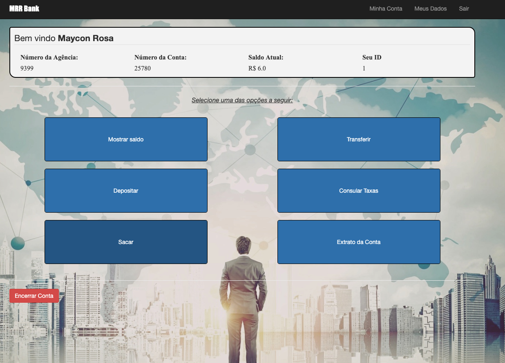
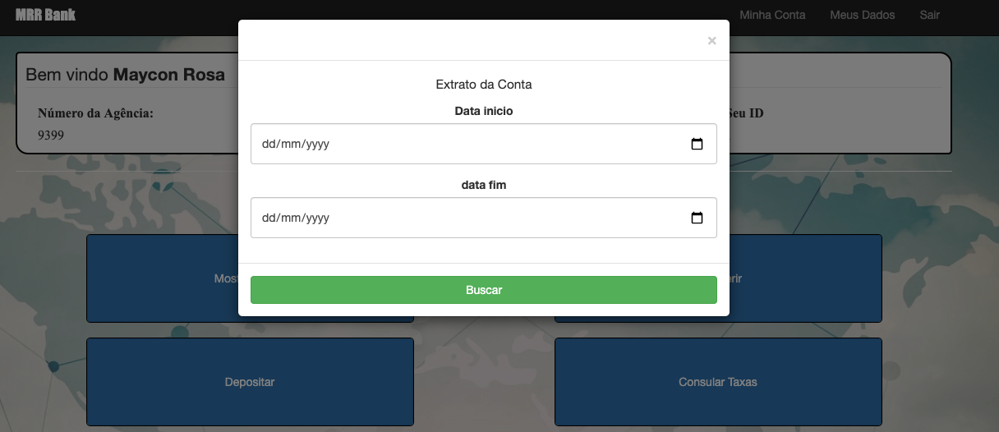
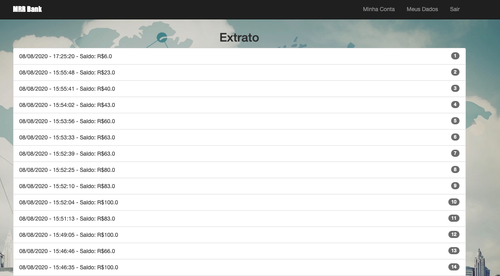

# MRR Bank
This is an app to simulate a bank system.
You can create and close your account, make deposits in your own account, make withdrawals and to transfer money (there will be rates depending on the day of the week and the time of the day) to another account.

# App Preview
Home Screen


Statement Session

- - - - -


## Ruby version
ruby 2.5.1

## Rails version
Rails 6.0

## System dependencies
Any *nix plataform

## Setup
Run in your console:
```
bin/setup
```
## User Create
Click in the "Nova Conta!" button and fill all the fields.

## Run tests
```
rspec spec/
```
